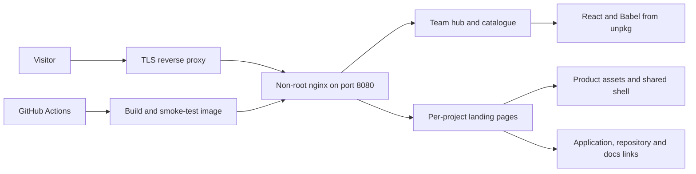

# Team AER landing pages — aer.app

The public project catalogue and product landing pages for **Team AER**. Visitors can
meet the team, browse projects by purpose, explore product features through interactive
previews, and follow links to applications, source code, documentation or access invitations.
This repository serves the website; each application's own repository implements the product.

[Visit aer.app](https://aer.app/) · [Team AER on GitHub](https://github.com/Team-AER) · [Page design guide](docs/APP-PAGES-DESIGN.md)

This is the canonical home for Team AER landing pages. The earlier `cantis-landing` and
`polyjuicevoice-landing` repositories are legacy snapshots; update the corresponding folders
here. Plain static files need no compiled build step. The team hub, Cantis and PolyJuiceVoice
use React and Babel in the browser; other app pages use HTML, CSS and vanilla JavaScript.

## What the site includes

- A grouped catalogue with product palettes, miniature interfaces, team authorship and upstream credits.
- Individual pages explaining product workflows, features, requirements and ways to get started.
- Interactive product illustrations and demos. These previews do not run the underlying AI models.
- Shared navigation, skip links, copy buttons, mobile menus and reduced-motion behavior.
- Page-specific metadata and icons, clean URLs and a custom not-found page.
- A non-root nginx container, response headers and a CI image smoke test.

| Page | Project purpose |
| --- | --- |
| `/` | Team introduction and project catalogue |
| `/pensieve/` | Feed reader, personalized daily paper and reading memory |
| `/hedwig/` | Unified self-hosted webmail; built on MailFlow |
| `/quill/` | Meeting transcription, speaker separation, slides and grounded notes |
| `/accio/` | Research across documents and the web with cited reports |
| `/erised/` | Illustrated solo and cooperative adventures |
| `/cantis/` | On-device music generation on Apple Silicon |
| `/polyjuicevoice/` | On-device speech generation, voice design and cloning |
| `/subtly/` | Desktop subtitles generated with Whisper |
| `/avifors/` | Demand-loaded GPU inference workers with bounded leases |
| `/athena/` | Self-hosted malware-analysis portal |
| `/omniocular/` | Pocket wireless-audit device and controller |
| `/promptmask/` | On-device prompt masking in a browser extension |

## How it works



The hub, Cantis and PolyJuiceVoice require external React/Babel scripts; Google Fonts
are used across the site. Local static serving does not make every page fully offline.
The production nginx configuration supplies routing, CSP and cache headers that a simple
Python file server does not reproduce.

## Layout

| Path | What it is |
|---|---|
| `aer.app.html`, `app.jsx`, `tweaks-panel.jsx` | Team page. React + Babel load from unpkg and JSX is transpiled in the browser. The app catalogue (`#projects`) is `PROJECT_GROUPS` in `app.jsx`. |
| `styles/tokens.css`, `styles/site.css` | Team page design tokens and styles (Gumroad-style hard shadows). |
| `styles/apps.css` | The app catalogue: tiles, each app's mini window in its own palette, tablet and phone layouts, reduced motion. |
| `<app>/index.html`, `style.css`, `page.js`, `assets/` | One self-contained landing page per app, themed in that app's own colours. Plain HTML, first-party scripts only. |
| `cantis/`, `polyjuicevoice/` | React + Babel pages (`index.html`, `app.jsx`, `sections.jsx`, `illustrations.jsx`, `motion.jsx`), formerly the separate cantis-landing and polyjuicevoice-landing repos. They get the team page's CSP. |
| `shared/base.css`, `shared/shell.js` | Shell shared by every app page: Team AER strip, footer, skip link, nav toggle, copy buttons, reveal on scroll. |
| `404.html` | Not-found page for any unknown path. |
| `docs/APP-PAGES-DESIGN.md` | Design direction and quality floor for the app pages. Not served. |

## Team branding

The square pink “a” and yellow spark is the Team AER logo. Versioned assets live in
`assets/brand/`: the transparent source, 192/512px icons, 32/64px favicons,
180px Apple touch icon, and a 1200×630 cream-background sharing thumbnail.
The homepage registers Open Graph and Twitter preview metadata; `favicon.ico`
also supports browsers that request the conventional root icon URL.
The shared Team AER strips use the team logo, while product favicons retain
their own identities. The local `.thumbnail` uses the square team icon and is
excluded from the deployed image.

## Run locally

Any static file server works; the team page is `aer.app.html`.

```sh
python3 -m http.server 8080
# http://127.0.0.1:8080/aer.app.html and http://127.0.0.1:8080/pensieve/
```

## Docker deployment

Standalone, hardened, non-root nginx serving over **HTTP only** and bound to
**localhost** (put a TLS-terminating reverse proxy in front for public access).

```sh
docker compose up -d --build
# http://127.0.0.1:8080/
```

Hardening in place:

- `nginxinc/nginx-unprivileged` base — runs as uid 101, listens on 8080, no root.
- Read-only root filesystem, `cap_drop: ALL`, `no-new-privileges`.
- Published port bound to `127.0.0.1` only — not exposed on any external NIC.
- GET/HEAD only, `server_tokens off`, security headers. Two CSPs (see
  `nginx.conf`): the team page and the Cantis and PolyJuiceVoice pages may
  load React/Babel from unpkg and eval; every other app page is limited to
  first-party scripts. Both allow Google Fonts.
- Clean URLs (`/pensieve` → `/pensieve/`), custom 404, `docs/` not served.

Tear down:

```sh
docker compose down
```

## Adding an app

1. Create `<slug>/index.html`, `style.css` and `page.js` (copy an existing page
   for the shell: strip, footer, skip link, `/shared/base.css`,
   `/shared/shell.js`). No inline scripts or `on*=` handlers.
2. Add it to `PROJECT_GROUPS` in `app.jsx` with its palette and a mini window
   (add a `case` to `Mini` and its styles to `styles/apps.css`).
3. Add it to the footer app list on the other app pages.
4. Set the page title, description, canonical product URL and product favicon. Use the
   source repository's current app icon; keep the Team AER mark for the shared strip.
5. Check feature claims against implemented source and current project documentation.
   Separate model download requirements from app size, and demos from measured performance.
6. Verify all page assets, links, keyboard behavior and narrow-screen layouts before opening a PR.

Preserve concise upstream attribution where relevant and retain any required license or
copyright notices when copying assets. Hedwig credits [MailFlow by @maathimself](https://github.com/maathimself/mailflow).
The Cantis and PolyJuiceVoice favicons are copied from their respective Team AER app icon sets;
their MIT notices are retained in [Cantis assets](cantis/assets/LICENSE) and
[PolyJuiceVoice assets](polyjuicevoice/assets/LICENSE).
Project licenses apply to their own code and assets; this repository has no root license file.

## Deploy

For an authorized deployment, pull the approved revision in the deployment checkout and
rebuild the container behind the TLS proxy. The existing host command is:

```sh
ssh ubuntu@aer.app 'cd ~/aer-landing && git pull --ff-only && docker compose up -d --build && docker image prune -f'
```

Pages load their own CSS/JS with a `?v=YYYYMMDD` stamp and HTML is served
`no-cache`, so visitors pick up a deploy on their next visit. When you change
a stylesheet or script, bump the stamp:

Update the affected page's `?v=` values when its CSS or scripts change. Avoid changing
unrelated page stamps in a documentation-only PR.

## CI

`.github/workflows/ci.yml` runs on every push / PR: lints the Dockerfile
(hadolint), builds the image, and smoke-tests that every page serves, clean
URLs redirect, unknown paths 404, `docs/` is hidden and each page gets the
right CSP.
